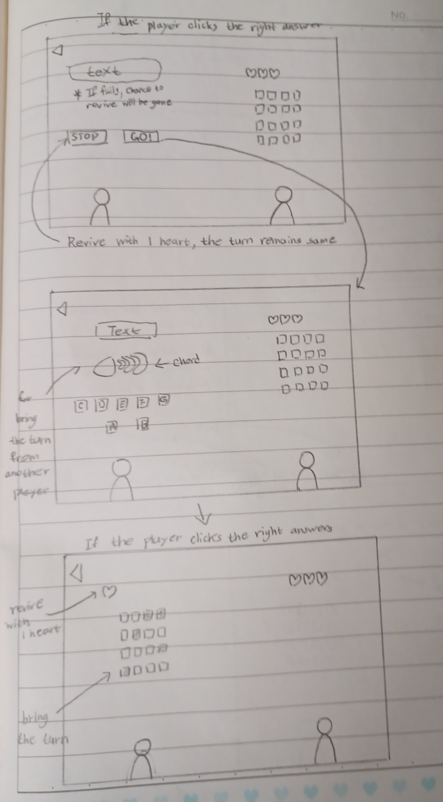
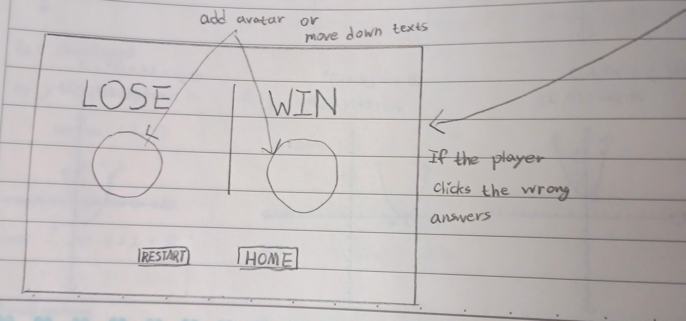

# Description

This is a memory game that includes music elements.

## 1 Player
There are 16 boxes which show patterns to player. Player memorize the patterns, then click the same boxes. If player click the same boxes, then the boxes will show another patterns. When a player clears 3 patterns, then the game will be clear. If a player clicks the wrong box, then the player's life will be decreased by 1 and boxes will show another pattern. When a player loses all life, the player can have a chance to revive. Player listen the sound of piano and guess what scale it is. If player clicks the right answer, then player can revive with 1 life. If not, the game will be over.

## 2 Players
Each player has life. When a player clears the pattern, the player can have a chance to throw a ball to another player to decrease their life. A player can throw the ball by stopping a stick in the right areas. If a player stops the stick in a blank area, the player can't throw the ball. If a player stops the stick in the blue area, the player can throw the ball to another player's avatar's body and decrease their life by 1. If a player stops the stick in the red area, the player can throw the ball to another player's avatar's head and decrease their life by 2. Then, the player continues to play. If the player can't clear the pattern, another player will take the turn. When each player loses all life, each player can get a chance to revive. As the same as the 1 player mode, a player listens to the sound and guesses what scale it is. If a player clicks the wrong answer, the other player will win. However, when a player clicks the right answer, the player can choose to stop here and revive with 1 life or solve one more problem to even take a turn from another player. If the player chooses to stop, then the player will revive with 1 heart and the other player still takes the turn. If the player chooses to solve one more problem, the player has to guess what chord it is after listening to the sound of the piano. If a player clicks the right answer, the player revives with 1 heart and brings a turn from another player. However, if the player clicks the wrong answer, even the chance to revive will be gone and another player will win. 

# Design
**Home && Stage (option) && Instruction**

**1 Player**

**2 Players**

